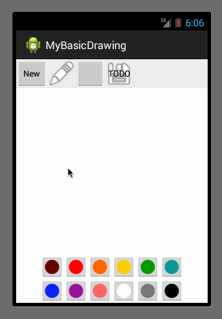

My Basic Drawing
================

Simple Drawing app for custom views and drawing studies.

## Installation

Import this project into eclipse using **File => Import => Existing Android Code** and the project should now compile.

### Assignment:

It took me about six hours.

- User can press down to draw on the canvas.

Done

- User can choose between at least 6 colors to draw with.

Done

- User can choose between at least 3 different brush sizes.
- User can press "New" to clear the canvas and start over.

Done

- Optional: User can save their drawing and give each drawing a name.

Not done

- Optional: User can open their drawing and select between saved drawings.

Not done

- Optional: User can choose to share out their drawing with other apps.

Not done

- Stretch: User can erase parts of their drawing.

Done (with white color)

GIF created with [LiceCap](http://www.cockos.com/licecap/).
